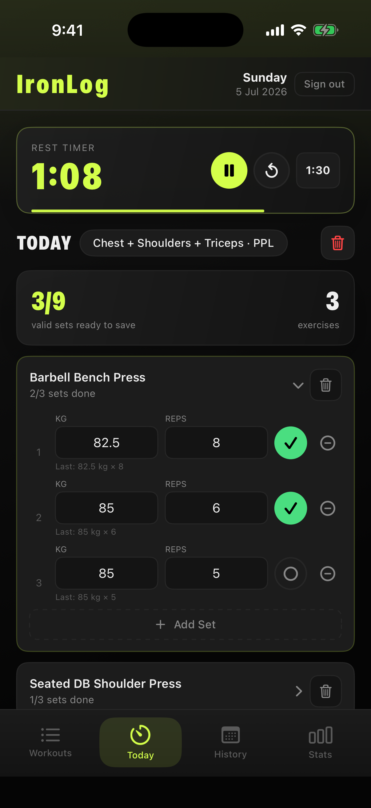
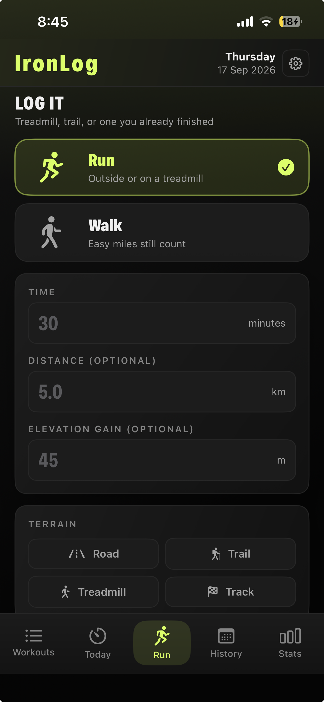
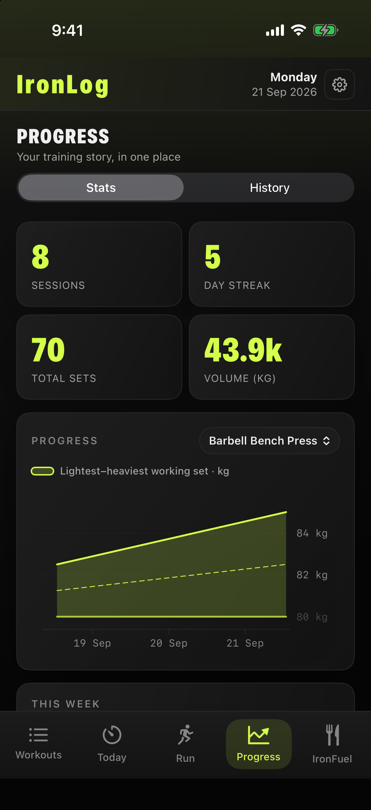
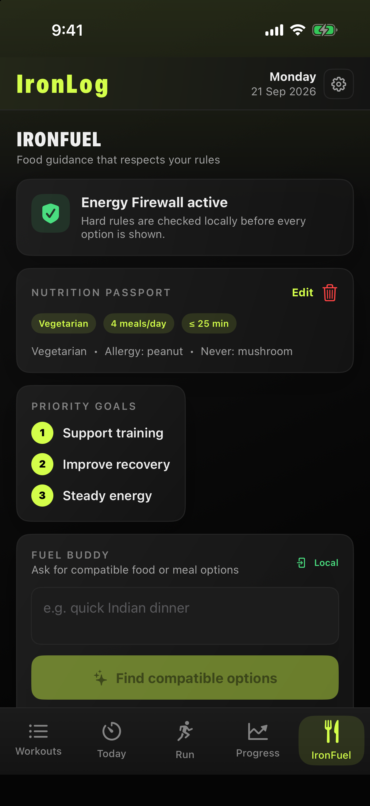

# IronLog

> **Launching soon** — a focused, free gym and running tracker for iPhone.

IronLog makes it easy to plan a workout, log every set, record a run, see the progress you have earned, and get food ideas that respect your rules. It is a native SwiftUI app backed by Supabase—no ads and no unnecessary noise.

## Built to keep momentum

- **Plan and log workouts** — choose a split, browse a full exercise library, and check off weighted sets and reps as you train.
- **Record every run** — capture time, distance, elevation gain, and terrain for runs, walks, treadmill sessions, and trails.
- **Keep the full story** — revisit past sessions, personal records, and notes whenever you need them.
- **See your progress** — follow sessions, streaks, total sets, training volume, and exercise-specific trends.
- **Fuel without guesswork** — create a private Nutrition Passport and request catalog-grounded meal options that always honor its hard rules.

## Inside IronLog

<table>
  <tr>
    <td width="25%" align="center"><br /><strong>Workout logger</strong><br />Find exercises and log sets as you go.</td>
    <td width="25%" align="center"><br /><strong>Run logging</strong><br />Capture distance, elevation, and terrain.</td>
    <td width="25%" align="center"><br /><strong>Progress</strong><br />Stats and full session history in one place.</td>
    <td width="25%" align="center"><br /><strong>IronFuel</strong><br />Private rules and compatible food options.</td>
  </tr>
</table>

## Features

- **Exercise catalog** — 80+ exercises across 7 muscle groups, each with sets, reps, and form tips
- **Splits** — Full Body, PPL, Upper/Lower, Bro Split, with multi-muscle days
- **Set logger** — log weight + reps, set types, and custom remarks per set
- **Custom exercises** — add anything mid-workout (reps only, or weight + reps)
- **Rest timer** — restarts from the preset each time you complete a set
- **Lock-screen Live Activity** (iOS) — log sets from the Lock Screen / Dynamic Island without unlocking
- **Draft persistence** — an in-progress workout survives app restarts
- **Progress** — switch between chronological history and sessions, streaks, volume, trends, and auto-detected PRs
- **IronFuel** — private Nutrition Passport, safety gates, deterministic hard-rule filtering, and offline catalog fallback
- **Water tracker** — daily 8-glass counter
- **Auth + cloud sync** — Supabase Auth (email/password) with Row Level Security

## Tech Stack

| Layer | Technology |
|-------|------------|
| Backend | Supabase (PostgreSQL, Auth, RLS) |
| iOS app | Swift + SwiftUI (project generated by XcodeGen; `.xcodeproj` committed) |

---

## 1. Backend Setup (Supabase)

1. Create a free project at [supabase.com](https://supabase.com).
2. From **Settings → API**, copy your **Project URL** and **anon / public key** for the next step.
3. Link the Supabase CLI, apply the source-controlled schema and RLS migrations, then deploy the authenticated account-deletion function:

   ```bash
   supabase link --project-ref YOUR_PROJECT_REF
   supabase db push
   supabase functions deploy delete-account
   ```

   Supabase provides `SUPABASE_URL`, `SUPABASE_ANON_KEY`, and `SUPABASE_SERVICE_ROLE_KEY` to the function. Keep the service-role key server-side; never add it to the iOS app.

4. To enable Google sign-in, add the Google OAuth client in **Authentication → Providers**. In Google Cloud, set the consent-screen app name to **IronLog** and register this Supabase callback exactly:

   ```text
   https://YOUR_PROJECT_REF.supabase.co/auth/v1/callback
   ```

   The iOS deep link (`ironlog://auth/callback`) belongs in Supabase Auth's Redirect URLs, not in Google Cloud.

### Supabase source of truth

- `supabase/migrations/` is the complete schema history. The first three files are a recovered, squashed baseline for migrations that existed remotely before the source was committed; all future database changes must be new migrations.
- `supabase/config.toml` holds non-secret project configuration. Provider secrets and SMTP passwords remain in the Supabase dashboard or CI secrets; do not run `supabase config push` without supplying those secrets.
- Validate policies locally with `supabase test db` before deploying database changes.

### Keep-alive workflow

The scheduled keep-alive workflow queries the database with the server-side `service_role` key because the anonymous role is intentionally denied table access. Store it as the repository Actions secret `SUPABASE_SERVICE_ROLE_KEY`; never commit it or add it to the iOS app.

## 2. Configure Your Keys

Point the app at your own Supabase project in [`IronLog/Services/SupabaseService.swift`](IronLog/Services/SupabaseService.swift): set `projectURL` and `anonKey`.

> The anon key is safe to commit — it's public by design, and RLS is what protects your data.

---

## 3. Run the iOS App

**Requirements:** macOS with Xcode 15+.

1. Open `IronLog.xcodeproj` in Xcode.
2. Pick a simulator or your iPhone and press **⌘R**.

The project is defined in [`project.yml`](project.yml); if you change its structure, regenerate with `xcodegen generate` (`brew install xcodegen`).

### Install to your iPhone for free (no TestFlight)

You can put IronLog on your own iPhone with a free Apple ID — no paid developer account. Run:

```bash
./scripts/install_iphone.sh
```

The [script header](scripts/install_iphone.sh) lists the one-time setup (sign in with your Apple ID, enable Developer Mode, set `IRONLOG_TEAM_ID`). After that, `git pull && ./scripts/install_iphone.sh` reinstalls the latest build.

> Free-signed builds stop launching after **7 days** — just re-run the script to refresh.

---

## Repo Layout

```
IronLog/            SwiftUI app (Views/, Services/, Live/ = Live Activity)
IronLogWidget/      Lock-screen Live Activity widget extension
IronLogTests/       Unit tests
images/             README product screenshots
supabase/           Database migrations, RLS tests, and account-deletion Edge Function
scripts/            build_ios_release.sh, upload_testflight.sh, install_iphone.sh
.github/workflows/  supabase-keepalive.yml (daily ping so the free tier never pauses)
```

## Notes

- **Keep-alive:** the free Supabase tier pauses after ~1 week of inactivity. [`supabase-keepalive.yml`](.github/workflows/supabase-keepalive.yml) pings it daily to prevent that; if it ever pauses anyway, restore it from the Supabase dashboard.
